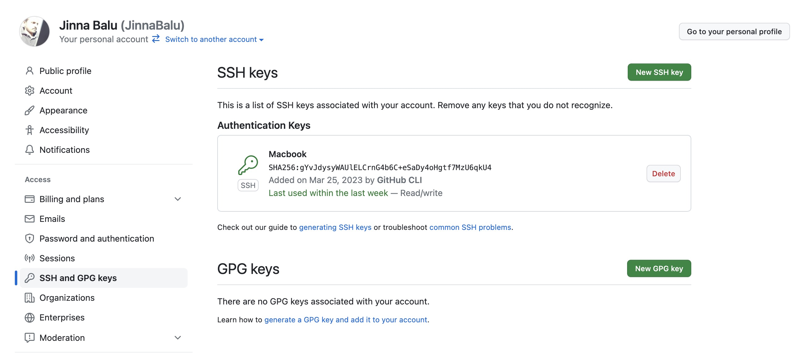

# Setup git push with SSH

## Generate SSH KEY with ssh-keygen

```bash
ssh-keygen -t rsa -C "your_github_email@example.com"
```

> Note : In local machines we may have multiple ssh keys, better to create the specific rsa. 
> Example : Enter file in which to save the key `(/home/ubuntu/.ssh/id_rsa): /home/ubuntu/.ssh/github_rsa`

```bash
O/P:

Generating public/private rsa key pair.
Enter file in which to save the key (/home/ubuntu/.ssh/id_rsa): /home/ubuntu/.ssh/github_rsa
Enter passphrase (empty for no passphrase): 
Enter same passphrase again: 
Your identification has been saved in /home/ubuntu/.ssh/github_rsa.
Your public key has been saved in /home/ubuntu/.ssh/github_rsa.pub.
The key fingerprint is:
SHA256:vddx6bSnZdfSM0/6pImd5l+yiycMZRMetgp70NuCcRcM *******@outlook.com
The key's randomart image is:
+---[RSA 2048]----+
|  .. .           |
|  .Eo .          |
| o....           |
|.oo..    .       |
|=.*.    T .      |
| *.+       . .   |
| ..o.. .  . ..B. |
| .+.. o oo .=@+o |
|  +o o. oo..=@J  |
+----[SHA256]-----+
```

## Github SSH connection setup

### 1. Copy the ssh from local machine

```bash
 cat /home/ubuntu/.ssh/github_rsa.pub
```

> O/P
> ssh-rsa AAAAB3NzaC1yc2EAAAADAQABAAABAQC/iLoHDq+6Bz5m5ED1TezxtCeW4U7eZueEqFX2eMo/BRQLVLzIMP7YyiYBR0xX57MgQ4cVodJV8pM0PYrSGSI1lQ5POSMrY4RDrH+KCVbLpifZAjaI94IKJtjnRm9eynk11g9DCg3z+OlxXmBBs1AO/zzqBXBoekfU753bD4u1yhycHiq6Iis9B2FHbV1Yov9ofswnZxh/xX7gXghLo4bdjpwfgDCRlUl4VUf7AeMY3ACwYsiEs1P6R0d1SUITgkP8D6pjmaxbroWLex43wkUxuS+nKJ9/kw7AmWnupBrUi0gfYzNwJI55vkOyhCF7 ********@outlook.com

### 2. Go to github [account settings](https://github.com/settings/keys) page

[](https://github.com/settings/keys)

### 3. Click on [](https://github.com/settings/ssh/new)

### 4. Add title and paste the copied ssh key from the local

### 5. Test SSH

```bash
ssh -T git@github.com
```

*Output:*
 
```bash
The authenticity of host 'github.com (192.30.253.113)' can't be established.
RSA key fingerprint is SHA256:nThbg6kXUpJWGl7E1IGOCspRomTxdCARLviKw6E5SY8.
Are you sure you want to continue connecting (yes/no)? yes
Warning: Permanently added 'github.com,192.30.253.113' (RSA) to the list of known hosts.
Hi JinnaBalu! You've successfully authenticated, but GitHub does not provide shell access.
```