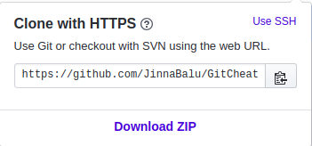
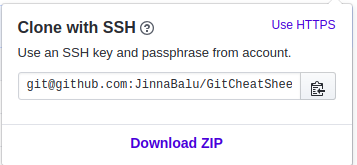

# Update the remote URL 

#### Update the Remote URL of the repository with the ssh url in place of https

- Copy the url from the  button with ssh

- Copy Clone with ssh URL - Clock *Use SSH* as in first screenshot

 

```bash
 git remote set-url origin git@github.com:JinnaBalu/GitCheatSheet.git
```

### 7. Test pushing with ssh

```bash
git add --all

git commit -am "testing the changes"

git push -u origin master
```

*DONE with Github*
